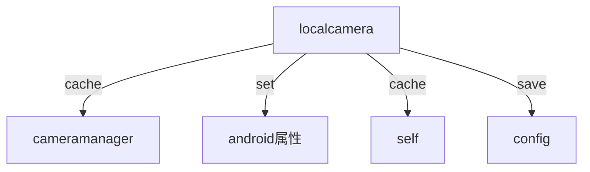
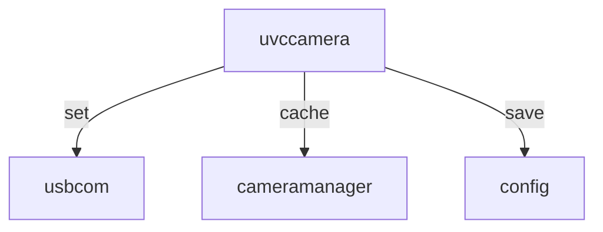

# camera
## 背景
从去年开始进入camera的维护开始，改了很多的问题，就算改了很多，但是还有很多源源不断的问题冒出来。期间有去试着调整，但是由于代码交叉，调整比较麻烦，因为工作量得问题，每次改问题都是以兼容处理。
AX0 多模前的版本印象最深的就是智能模式，一直在修修补补，因为机型的差异，只要修改一下代码很容易就会引入问题。
整个camerad从去年到现在，内部代码还没有优化过，有很多无用的代码，且原来的代码框架并不是适合多camera，目前camera种类较多，原来的代码原型新增其它camera代价较大。整个历程，bug数量是比较多的，很多bug改的很快，主要原因我太菜了，改了这个问题忘记了其它的问题。

## 摄像头种类
| cam6x、cam12x | 高通内置camera（AX0\IWB\A10） |  uvc84 |  高通外置UVC86  | 第三方摄像头  |
| --- | --- | --- | --- | --- |
| 属性值同uvc84，支持光圈 | 高通camera，参数属性走系统层 | uvc camera，所有数据通信走usbcom通道 | uvc86 的设置同uvc84，走usbcom hid节点，但是参数值同高通的参数配置，与高通内置camera参数效果相同 | 相当于辅流，不需要支持ptz、参数，但是有单独的一个名字 |

## camera 内部通信分析
| |CAM6\12X | 高通内置AX0\IWB\A10 | UVC84 | 高通外置UVC86 | 第三方 |
|--- |--- |--- |--- |--- |--- |
| 参数设置 | USBCOM | Android属性 | USBCOM | USBCOM | 无 |
| 智能模式设置 | 杭分 | 杭分、Android属性 | USBCOM<br>SG:杭分、mediacamera | USBCOM<br>SG:杭分、mediacamera  | 无 |
| 参数保存 | 主机配置、开机加载 | 主机配置 | uvccamera 配置 | uvccamera 配置 | 无 |
| 智能模式保存 | 主机配置、开机加载 | 主机配置，同12X区分 | uvccamera 自身配置 | uvccamera 配置 | 无 |
| ptz | USBCOM->ISP | ISP | USBCOM->ISP | USBCOM->ISP | 无 |
- 预设位属于其它功能
- mediacamera属于对接系统层，后面需要跟usbcom耦合起来用，也就是hid节点同video节点绑定，但是模块相对独立，所以不需要安排修改
### 结构图如下


## 模块存在的问题分析
### 问题1
简单看一下一段代码
```c++
bool CCameraClient::StartMove(const int nDirection, bool bSend)
{
    if (!m_bOpenPrivacyGuaid)
    {
        CAM_INFO_EX(TAG "<StartMove:{}><PrivacyGuaid is not open!>", m_nID);
        return false;
    }
    CAM_INFO_EX(TAG "start move type[{}] d[{}]", m_nCameraType, nDirection);
    m_iStartMove = nDirection;
    bool bRet = false;
    switch (m_nCameraType)
    {
    case CCT_CAMERA_LOCAL:
        {
            if (_CameraData.IsQualcommCamera())
            {
                __LocalCameraManager.StartMove(nDirection);
                break;
            }   

            bRet = localcamera_StartMove(nDirection);
        }
        break;
    case CCT_CAMERA_3RD:
        {
            CameraClientAdapter_StartMove(nDirection);
            bRet = true;
        }
        break;
    case CCT_CAMERA_UVC:
        {
            if (m_ParamInfo.mapCameraParam[CF_INTELLIGENCE_MODE] != 0)
            {
                CAM_INFO_EX(TAG "startmove control disabled. is intelligence mode!");
                etl_NotifyApp(FALSE, MT_CAMERA_PTZ_STATUS_CHANGE, 0, 0);
                return false;
            }

            int nPtValue = GetDirection(nDirection);
            _UVCCameraMng.SetUvcCameraParam(m_info.m_strSN, V4L2_ID_PTZCTRL, nPtValue, false);
            etl_NotifyAppEx(FALSE, MT_CAMERA_MOVING_STARTED, m_nID, IsActive(), sizeof(int), &nDirection);
        }
        break;
    case CCT_CAMERA_RPC:
        {
            if (!bSend)
            {
                break;
            }

            bRet = true;
            CClientHelper::SetStartMove(m_info.m_strIp, nDirection);
        }
        break;
    default:
        break;
    }

    return bRet;
}
```
startmove，功能：控制镜头上下左右，camera ptz 必备的接口。目前这个接口里面区分了各种摄像头的控制方式，如果在需求不变的情况下，这样用也没啥问题，但是如果后期需要新增一个其它控制方式的camera，相当于每类这个接口都需要添加case，增加了代码的复杂度不说，主要的问题是这类接口比较多，很容易忽略掉某个接口。

### 问题2
内置camera目前自己搞了一套camera参数处理逻辑，完全是另外的一套，同外接camera ptz控制、参数控制、数据本地保存等完全分离，这样会让修改cam6x 这种既是外接又算内置的camera无法维护。之前内置的也分了两套控制逻辑，工作量更大。目前等海思去掉之后，内置控制只有一套逻辑。
目前内置参数有两套存储地方，维护效果差，各种camera的参数差异导致经常出现bug；ptz控制优化后，由之前的2000多行，控制到了目前的600行，直接使用即可

### 问题3
当前同杭分通信分两块，一块以丁静为主，负责系统camera、mediacamera的处理，包括枚举、id创建；一块以王金鑫为主，主要为智能模式设置，智能模式主要对接wjx，同dj也有关联。最初AX0同杭分通信是针对智能模式和A30控制ptz的。因为智能模式没有约束，根据图像的需求想加就加，期间增加了比较多的通信方式，目前主要的内置camera智能模式只有一条通道，其他的都是辅助（Android变量、isp需要知道某个模式、86、84 SG 需要告知丁静）。
存在的主要问题：同YRC对比，camera的智能模式YRC做的比较完美，只有两种语音追踪和自动框景，其他的都是这两种下面的子项，事实也是如此；但是AX0这边诞生出来了各种各样的只能模式，都是之前根据测试想要的效果直接就添加了，导致现在测试根据测试效果，变来变去（比如MF没有开放速度选项，就让固定一个速度，这个速度是代码写死的，随时可能变更）。表达这些是想说明这一块很乱，且目前86 的SG 走在了主机这边，需要通知杭分。
```c++
#define AF_MODE_AUTO_FRAMING 1 //自动框景
#define AF_MODE_VOICE_TRACKING 2 //语音追踪
#define AF_MODE_FIELD_OF_VIEW 3 //视角裁剪
#define AF_MODE_MULTI_SCREEN 4 //多分屏
#define AF_MODE_PIP_MODE 5 //画中画
#define AF_MODE_SMART_GALLERY_MODE 6 //智能画廊 也称 多流
#define AF_MODE_OPEN_MULTI_PIP_MODE 7 //新增开启muilt和pip
#define AF_MODE_FOLLOW_MODE 8 //广域追踪  演讲者追踪
```
```c++
// 智能模式 0 手动 1 AF 2 ST
#define ANDROID_CC_TRACK_MODE "android.cc.track.mode"
```
实际上就两种，变更出来了这么多种不应该存在的模式，以至于预设位都变成了智能模式

### 问题4
camerad的第一个版本是由AX0 V22的代码集成的，针对的是IWB 内置和CAM6X，当时是属于快速集成cam6x的功能，并没有做什么设计，这样就导致cam6x做了很多的兼容（因为他是比较特殊的一个camera）。开发到现在，AX0、M500之类的

## 模块优化路线
针对这些场景，目标是将各种camera的使用设计为低耦合。
### 1 去掉多余原始代码

### 2 camera图像参数、智能模式参数调整
针对以下几个场景做处理
+ 参数加载 -- 区分camera
+ 参数设置 -- 区分camera
+ 参数传输 -- 不区分camera
+ 参数缓存 -- 不区分camera
+ 参数存储 -- 区分camera
1、参数加载
内置camera可以做到统一，读取主机配置即可；
uvccamera分两种，cam6x、其他uvc系列，6x读取自身那套配置，其他uvc读取设备上的
2、参数设置
内置走android属性
uvc走usbcom


3、参数存储
记录在配置里面
cam6x 单独一套配置存储，其他uvc存储在设备端